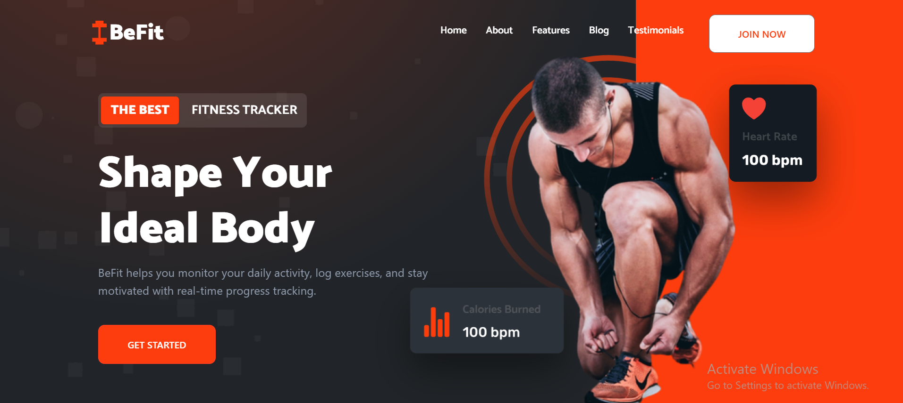

<div align="center">

# 🏋️ BeFit — Fitness Tracker MERN

A modern full-stack fitness tracking platform built with the **MERN stack**. BeFit helps users track workouts, food logs, calories, goals, body metrics, and AI-powered fitness guidance from a clean dashboard experience.


</div>

---

## 📌 Project Overview

**BeFit** is a fitness and nutrition tracker designed for users who want one place to manage daily health activity. The app includes authentication, user dashboards, role-based admin controls, workout logs, food tracking, health calculators, goal management, AI fitness tips, and nutrition lookup support.

## ✨ Premium Features

- 🔐 **JWT authentication** with protected user/admin routes
- 👤 **Profile setup and profile management**
- 🏋️ **Workout log system** with create, update, detail, and analytics pages
- 🍽️ **Food log management** with nutrition summary and macro charts
- 🔥 **AI calorie checker** powered by nutrition API integration
- 🤖 **AI fitness assistant** for short, practical fitness tips
- 🎯 **Goal tracking** for fitness progress
- 📊 **BMI, BMR, macro, and TDEE calculators**
- ⏱️ **Stopwatch page** for workout timing
- 🔔 **Notification-ready dashboard experience**
- 🧑‍💼 **Admin panel** for users, blogs, testimonials, recycle bin, profile, and password management
- 🌙 **Theme context** for dashboard UI customization
- 🛡️ **Security middleware** using Helmet, rate limiting, CORS, and request logging

---

## 🖼️ Screenshots

> Screenshots are stored in `docs/screenshots/` so they render correctly on GitHub.

### Home



---

## 🧰 Tech Stack

### Frontend

- React 19
- Vite
- React Router DOM
- Bootstrap / React Bootstrap
- Framer Motion
- Chart.js, Recharts, React Chart.js 2
- React Toastify
- Axios
- Socket.IO Client

### Backend

- Node.js
- Express.js
- MongoDB / Mongoose
- JWT authentication
- BcryptJS
- Multer uploads
- Nodemailer
- Helmet
- Morgan
- Express Rate Limit
- PDFKit / JSON2CSV utilities
- Groq AI API integration
- USDA FoodData Central API integration

---

## 📁 Folder Structure

```bash
BeFit-Fitness-Tracker-MERN/
├── backend/
│   ├── config/
│   ├── controllers/
│   ├── middlewares/
│   ├── models/
│   ├── routes/
│   ├── services/
│   ├── uploads/
│   ├── utils/
│   ├── validators/
│   ├── .env.example
│   ├── package.json
│   └── server.js
├── frontend/
│   ├── public/
│   ├── src/
│   │   ├── api/
│   │   ├── assets/
│   │   ├── components/
│   │   ├── context/
│   │   ├── data/
│   │   ├── features/
│   │   │   ├── admin/
│   │   │   ├── auth/
│   │   │   ├── dashboard/
│   │   │   └── home/
│   │   ├── hooks/
│   │   ├── styles/
│   │   ├── App.jsx
│   │   └── main.jsx
│   ├── package.json
│   └── vite.config.js
├── docs/
│   └── screenshots/
├── .gitignore
├── LICENSE
└── README.md
```

---

## ⚙️ Environment Variables

Create a `.env` file inside the `backend` folder using the included example file:

```bash
cd backend
cp .env.example .env
```

Then update the values:

| Variable | Description |
| --- | --- |
| `PORT` | Backend server port, usually `5000` |
| `NODE_ENV` | App environment, for example `development` |
| `CORS_ORIGIN` | Frontend URL, usually `http://localhost:5173` |
| `MONGO_URI` | MongoDB connection string |
| `JWT_SECRET` | Secret key for signing auth tokens |
| `EMAIL_USER` | Email account used for OTP/password flows |
| `EMAIL_PASS` | Email app password or SMTP password |
| `USDA_API_KEY` | USDA FoodData Central API key |
| `GROQ_API_KEY` | Groq API key for AI fitness tips |

---

## 🚀 Getting Started

### 1. Clone the repository

```bash
git clone https://github.com/CodeByMan/befit-fitness-tracker-mern.git
cd befit-fitness-tracker-mern
```

### 2. Install backend dependencies

```bash
cd backend
npm install
```

### 3. Configure backend environment

```bash
cp .env.example .env
```

Update `.env` with your MongoDB URI, JWT secret, email credentials, and API keys.

### 4. Start the backend server

```bash
npm run dev
```

Backend runs by default at:

```bash
http://localhost:5000
```

### 5. Install frontend dependencies

Open a new terminal:

```bash
cd frontend
npm install
```

### 6. Start the frontend development server

```bash
npm run dev
```

Frontend runs by default at:

```bash
http://localhost:5173
```

---

## 📜 Available Scripts

### Backend

| Command | Description |
| --- | --- |
| `npm run dev` | Start backend with Nodemon |
| `npm start` | Start backend with Node |

### Frontend

| Command | Description |
| --- | --- |
| `npm run dev` | Start Vite development server |
| `npm run build` | Create production build |
| `npm run preview` | Preview production build locally |
| `npm run lint` | Run ESLint |

---

## 🔗 API Modules

The backend is organized into route modules under `/api`:

| Module | Base Route |
| --- | --- |
| Authentication | `/api/auth` |
| Users | `/api/user` |
| Profiles | `/api/profile` |
| Workouts | `/api/workouts` |
| Nutrition | `/api/nutrition` |
| Food Logs | `/api/foodlog` |
| Admin | `/api/admin` |
| Testimonials | `/api/testimonials` |
| Stats | `/api/stats` |
| Blogs | `/api/blogs` |
| Goals | `/api/goal` |
| AI Tips | `/api/ai` |

---

## 🧪 Production Build

Build the frontend:

```bash
cd frontend
npm run build
```

The production files are generated in:

```bash
frontend/dist
```

For deployment, configure your host so the backend serves or redirects to the Vite `dist` build output.

---

## 🧑‍💻 Author

**Muhammad Ali Nawaz**  
MERN Full-Stack Developer

---

## 📄 License

This project is open-sourced software licensed under the [MIT license](LICENSE).

---

<p align="center">
  <b>⭐ If you like this project, consider starring the repository!</b>
</p>

